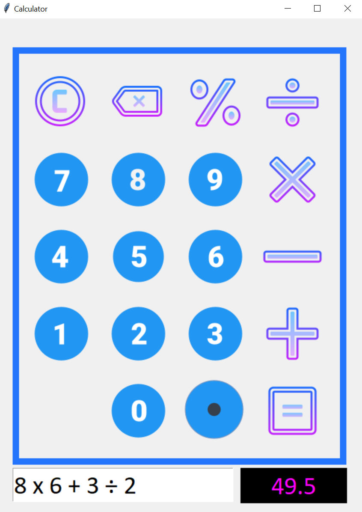
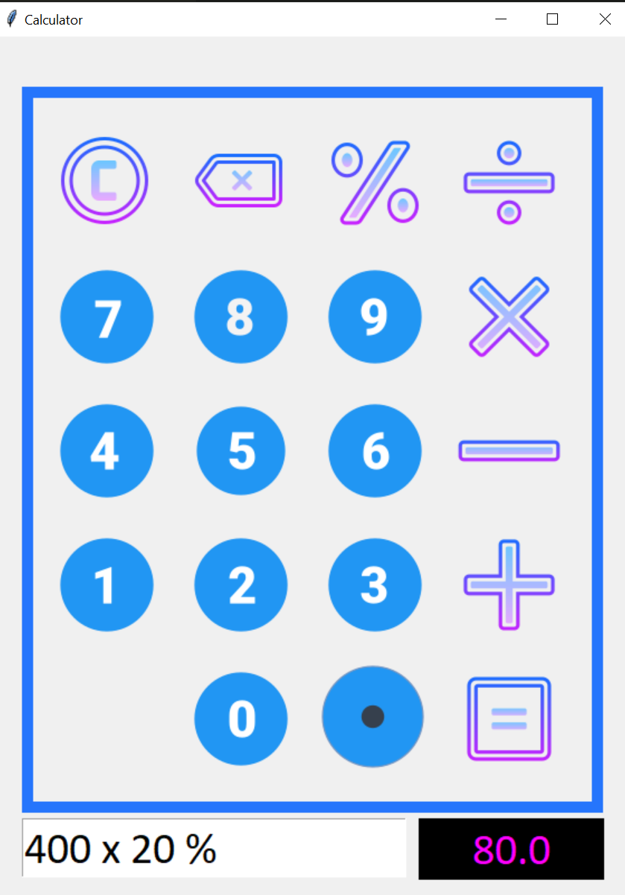

# Simple GUI Calculator

## Introduction

The Simple GUI Calculator is a Python application developed using Tkinter, designed to perform basic arithmetic operations in a graphical user interface.

## Features

- Addition, subtraction, multiplication, and division operations
- Clear button to reset the calculator
- Responsive and user-friendly interface
- Basic error handling for invalid inputs

## Technologies Used

- Programming Language: Python
- GUI Toolkit: Tkinter

## Installation

1. Clone the repository:
    ```sh
    git clone https://github.com/sanjaikrp/Calculator.git
    ```
2. Navigate to the project directory:
    ```sh
    cd Calculator
    ```

3. Run the application:
    ```sh
    python calculator.py
    ```

## Usage

1. Enter numbers using the buttons or keyboard.
2. Click on the operation buttons (+, -, *, /) to perform calculations.
3. Use the Clear button to reset the calculator for a new calculation.

## Screenshots

<p align="center">
    &nbsp;&nbsp;&nbsp;
    </p>
<p align="center">
    
</p>
